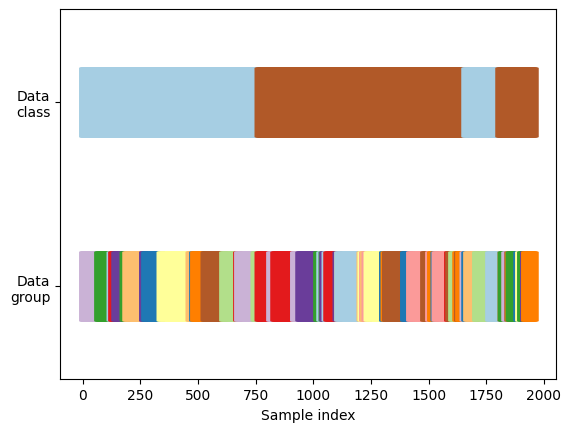
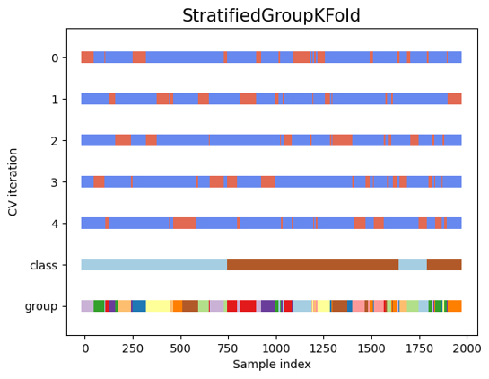
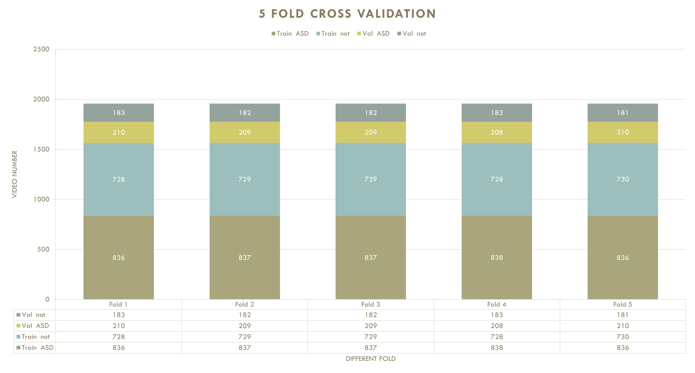
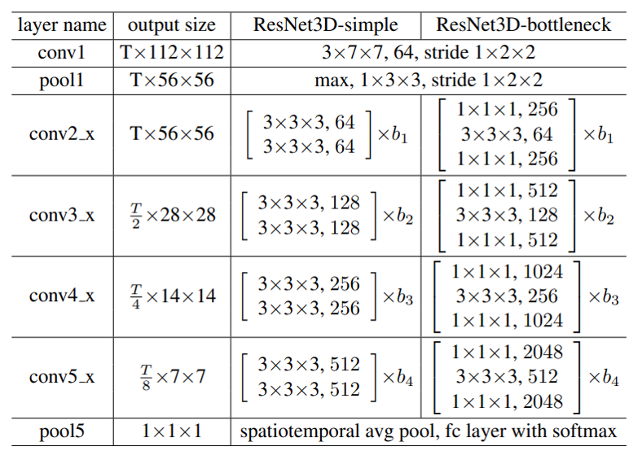

<div align="center">

# Two-stage video-based convolutional neural networks for adult spinal deformity classification

[](https://www.frontiersin.org/journals/neuroscience/articles/10.3389/fnins.2023.1278584/full)

</div>

## Abstract

**Introduction**: Assessment of human gait posture can be clinically effective in diagnosing human gait deformities early in life. Currently, two methods—static and dynamic—are used to diagnose adult spinal deformity (ASD) and other spinal disorders. Full-spine lateral standing radiographs are used in the standard static method. However, this is a static assessment of joints in the standing position and does not include information on joint changes when the patient walks. Careful observation of long-distance walking can provide a dynamic assessment that reveals an uncompensated posture; however, this increases the workload of medical practitioners. A three-dimensional (3D) motion system is proposed for the dynamic method. Although the motion system successfully detected dynamic posture changes, access to the facilities was limited. Therefore, a diagnostic approach that is facility-independent, has low practice flow, and does not involve patient contact is required.

**Methods**: We focused on a video-based method to classify patients with spinal disorders either as ASD, or other forms of ASD. To achieve this goal, we present a video-based two-stage machine-learning method. In the first stage, deep learning methods are used to locate the patient and extract the area where the patient is located. In the second stage, a 3D CNN (convolutional neural network) device is used to capture spatial and temporal information (dynamic motion) from the extracted frames. Disease classification is performed by discerning posture and gait from the extracted frames. Model performance was assessed using the mean accuracy, F1 score, and area under the receiver operating characteristic curve (AUROC), with five-fold cross-validation. We also compared the final results with professional observations.

**Results**: Our experiments were conducted using a gait video dataset comprising 81 patients. The experimental results indicated that our method is effective for classifying ASD and other spinal disorders. The proposed method achieved a mean accuracy of 0.7553, an F1 score of 0.7063, and an AUROC score of 0.7864. Additionally, ablation experiments indicated the importance of the first stage (detection stage) and transfer learning of our proposed method.

**Discussion**: The observations from the two doctors were compared using the proposed method. The mean accuracies observed by the two doctors were 0.4815 and 0.5247, with AUROC scores of 0.5185 and 0.5463, respectively. We proved that the proposed method can achieve accurate and reliable medical testing results compared with doctors' observations using videos of 1 s duration. All our code, models, and results are available at https://github.com/ChenKaiXuSan/Walk_Video_PyTorch. The proposed framework provides a potential video-based method for improving the clinical diagnosis for ASD and non-ASD. This framework might, in turn, benefit both patients and clinicians to treat the disease quickly and directly and further reduce facility dependency and data-driven systems.

## Description

📓 This project made with the PyTorch, PyTorch Lightning, PyTorch Video.

This project implements the task of classifying different medical diseases.

The current phase performs a dichotomous classification task for four different disorders. classification of ASD and non-ASD.

The whole procedure is divided into two steps:

1. using the detection method to extract the character-centered region and save it as a video.
2. put the 1. processed video into 3D CNN network for training.

Detailed comments are written for most of the methods and classes.
Have a nice code. 😄

## Folder structure

```bash
Walk_Video_PyTorch
|-- imgs
|   imgs for markdown.
|-- logs
|   output logs and saved model .ckpt file location.
`-- project
    |-- dataloader
    |   pytorch lightning data module based dataloader, to prepare the train/val/test dataloader for different stage.
    |-- models
    |   pytorch lightning modeul based model, where used for train and val.
    |-- prepare_video
    |   one stage prepare video code location
    `-- utils
        tools for the code.
```

## How to run

1. install dependencies

```bash
# clone project
git clone https://github.com/ChenKaiXuSan/Walk_Video_PyTorch.git

# install project
cd Walk_Video_PyTorch/
pip install -e .
pip install -r requirements.txt
```

2. navigate to any file and run it.

```bash
# module folder
cd Walk_Video_PyTorch/

# run module
python project/main.py [option] > logs/output_log/xxx.log
```

### one stage

In this stage, the interface provided by [detector2](https://detectron2.readthedocs.io/en/latest/index.html) is used for video pre-processing, in order to extract the area centered on the person and save a series of frames as video with a uniform FPS = 30.

The implementation of the prepare_video.py file,

```python
usage: prepare_video.py [-h] [--img_size IMG_SIZE] [--num_workers NUM_WORKERS] [--data_path DATA_PATH] [--split_pad_data_path SPLIT_PAD_DATA_PATH] [--split_data_path SPLIT_DATA_PATH]

optional arguments:
  -h, --help            show this help message and exit
  --img_size IMG_SIZE
  --num_workers NUM_WORKERS
                        dataloader for load video
  --data_path DATA_PATH
                        meta dataset path
  --split_pad_data_path SPLIT_PAD_DATA_PATH
                        split and pad dataset with detection method.
  --split_data_path SPLIT_DATA_PATH
                        split dataset with detection method.

```

for example,

```python
cd Walk_Video_PyTorch/project/prepare_video/

python prepare_video.py --img_size 512 --data_path [meta dataset path] --split_pad_data_path [split and pad dataset path] --split_data_path [split dataset path] > ./split_log.log &

```

⚠️ You need to replace the content in [ ] with your own actual path.

### two stage

In this stage, the pre-processed video needs to be read and fed to the 3d cnn network for training.

the implementation of the main.py file.

```python

usage: main.py [-h] [--model {resnet,csn,x3d}] [--img_size IMG_SIZE] [--version VERSION] [--model_class_num MODEL_CLASS_NUM] [--model_depth {50,101,152}] [--max_epochs MAX_EPOCHS] [--batch_size BATCH_SIZE] [--num_workers NUM_WORKERS] [--clip_duration CLIP_DURATION]
               [--uniform_temporal_subsample_num UNIFORM_TEMPORAL_SUBSAMPLE_NUM] [--gpu_num {0,1}] [--lr LR] [--beta1 BETA1] [--beta2 BETA2] [--data_path DATA_PATH] [--split_data_path SPLIT_DATA_PATH] [--split_pad_data_path SPLIT_PAD_DATA_PATH] [--log_path LOG_PATH]
               [--pretrained_model PRETRAINED_MODEL]

optional arguments:
  -h, --help            show this help message and exit
  --model {resnet,csn,x3d}
  --img_size IMG_SIZE
  --version VERSION     the version of logger, such data
  --model_class_num MODEL_CLASS_NUM
                        the class num of model
  --model_depth {50,101,152}
                        the depth of used model
  --max_epochs MAX_EPOCHS
                        numer of epochs of training
  --batch_size BATCH_SIZE
                        batch size for the dataloader
  --num_workers NUM_WORKERS
                        dataloader for load video
  --clip_duration CLIP_DURATION
                        clip duration for the video
  --uniform_temporal_subsample_num UNIFORM_TEMPORAL_SUBSAMPLE_NUM
                        num frame from the clip duration
  --gpu_num {0,1}       the gpu number whicht to train
  --lr LR               learning rate for optimizer
  --beta1 BETA1
  --beta2 BETA2
  --data_path DATA_PATH
                        meta dataset path
  --split_data_path SPLIT_DATA_PATH
                        split dataset path
  --split_pad_data_path SPLIT_PAD_DATA_PATH
                        split and pad dataset with detection method.
  --log_path LOG_PATH   the lightning logs saved path
  --pretrained_model PRETRAINED_MODEL
                        if use the pretrained model for training.
```

for example,

```python

python project/main.py --version [the version for train] --model resnet --model_depth 50 --img_size [img size] --batch_size [batch size] --clip_duration [the clip duration] --uniform_temporal_subsample_num [how many frames for train] --num_workers 16 > logs/output_logs/[version].log 2>&1 &

```

⚠️ You need to replace the content in [ ] with your own actual path.

# Experimental setup

## Dataset

Due to the limitation of the dataset, we decide to use 5 fold cross validation.
This figure give the details of our dataset, where data class mean the differenet disease label, as ASD and non-ASD.
The data group mean the number of patients, here we have 81 person.


After the 5 fold cross validation splitted, we get the final train/val dataset.
Here the oringal bar mean the val dataset and the blue bar mean the train dataset.



> ⚠️ Ensure that the same patient does not appear in training/validation at the same time.
> The number of videos can be guaranteed to be balanced, but the number of patients cannot.

Next give the details information of different fold.


## Data augmentation

Because the detection method is used to first extract the features of the characters into squares, there is no need to consider the border inconsistency when convolving.
We use both spatial and temporal jittering for augmentation.

Each clip is then generated by randomly cropping windows of size 224x224.
We train and evaluate models with clips of different frames (T = 16, 32, 64) by skipping every other frame (all videos are pre-processed to 30fps).

At the [data_loader.py](project/dataloader/data_loader.py) we defined the transform function.

```python
self.train_transform = Compose(
            [
                ApplyTransformToKey(
                    key="video",
                    transform=Compose(
                        [
                            UniformTemporalSubsample(self.uniform_temporal_subsample_num),

                            Div255(),
                            Normalize((0.45, 0.45, 0.45), (0.225, 0.225, 0.225)),

                            Resize(size=[self._IMG_SIZE, self._IMG_SIZE]),
                            RandomHorizontalFlip(p=0.5),
                        ]
                    ),
                ),
            ]
        )
```

## Network Structure

So far, we have used the 3D Resnet structure, which are given in the next figure.


## Experimental point

1. different frame with 3DCNN.
2. pre-train/scratch different in experimental.
3. pre-process (object detection extract) make sense in the experimental. (prepare)

## Transfer learning experiments

A natural question that arises is whether these features also generalize to other datasets and class categories.
We examine this question in detail by performing transfer learning experiments on the Kinetis-400.

⚠️ This time we use the 1s 32 frame and 224x224 video frame shape as the input data.

- fine-tune top layer (head)
- fine-tune last layer (stem) and top layer (head)
- fine-tune all layers
- train from scratch

## Experimental results

- from scratch
  show the Top@1 acc and Top@1 precision respectively.

| from scratch | 1s 16frame | 2s 32 frame | 3s 64 frame |
| ------------ | ---------- | ----------- | ----------- |
| accuracy     | 0.36       | 0.61        | 0.68        |
| precision    | 0.69       | 0.75        | 0.70        |

- pre-train on Kinetics-400, which 8 frame length and 8 sample rate.

  sample rate = (num_frames \* sample rate) / frame per second

| pretrain  | 1s 16frame | 2s 32 frame | 3s 64 frame |
| --------- | ---------- | ----------- | ----------- |
| accuracy  | 0.65       | 0.62        | **0.81**    |
| precision | 0.88       | 0.71        | nan         |

| ablation study | 1s 8 frame | 2s 8 frame | 3s 8 frame |
| -------------- | ---------- | ---------- | ---------- |
| accuracy       | 0.68       | 0.69       | 0.68       |
| precision      | 0.63       | 0.62       | 0.53       |

| ablation study | 1s 16 frame | 2s 16 frame | 3s 16 frame |
| -------------- | ----------- | ----------- | ----------- |
| accuracy       | x           | 0.71        | 0.67        |
| precision      | x           | 0.57        | 0.59        |

| ablation study | 1s 32 frame | 2s 32 frame | 3s 32 frame |
| -------------- | ----------- | ----------- | ----------- |
| accuracy       | **0.82**    | x           | 0.65        |
| precision      | 0.80        | x           | 0.60        |

x means the number in the first table.

⚠️ **The accuracy have an exact calculation, but the precision has some problem when calculation, and is not accurate. So we hope the accuracy score will be used for reference.**

## Docker

We recommend using docker to build the training environment.

1. pull the official docker image, where release in the [pytorchlightning/pytorch_lightning](https://hub.docker.com/r/pytorchlightning/pytorch_lightning)

```bash
docker pull pytorchlightning/pytorch_lightning
```

2. create container.

```bach
docker run -itd -v $(pwd)/path:/path --gpus all --name container_name --shm-size 32g --ipc="host" <images:latest> bash
```

3. enter the container and run the code.

```bash
docker exec -it container_name bash
```
